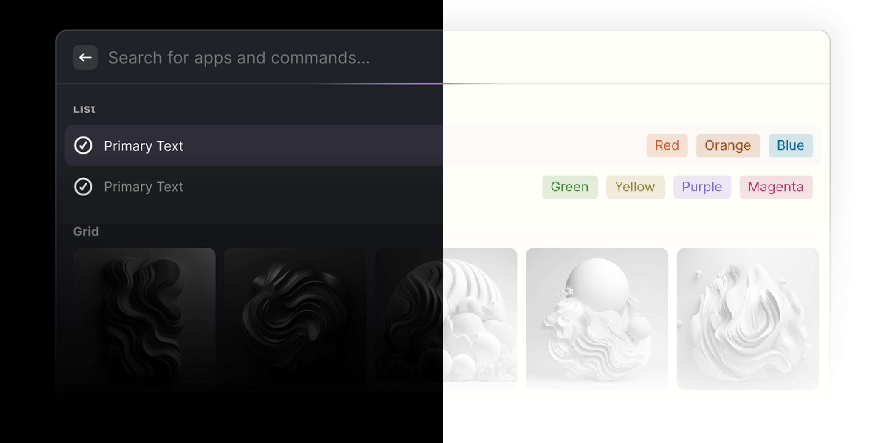

# Dracula for [Raycast](https://raycast.com/?via=luxonauta)

> A dark & light theme for [Raycast](https://raycast.com/?via=luxonauta).

## Install

> Custom Themes require a Pro Raycast subscription. [Upgrade here!](https://raycast.com/?via=luxonauta)

All instructions can be found at [draculatheme.com/raycast](https://draculatheme.com/raycast).

## Team

This theme is maintained by the following person(s) and a bunch of [awesome contributors](https://github.com/dracula/raycast/graphs/contributors).

|  |
| --------------------------------------------------------------------------------------------- |
| [Lucas de França](https://github.com/luxonauta)                                               |

## Community

- [Twitter](https://twitter.com/draculatheme) - Best for getting updates about themes and new stuff.
- [GitHub](https://github.com/dracula/dracula-theme/discussions) - Best for asking questions and discussing issues.
- [Discord](https://draculatheme.com/discord-invite) - Best for hanging out with the community.

## Dracula PRO

## License

[MIT License](./LICENSE)
